# Opik Azure Kubernetes Deployment

This will provide an overview
of how this Opik repository is being deployed
to Azure Kubernetes Service (AKS) with external access through NGINX Ingress Controller.

We recommend you read all the sections
because some assumptions were made based on the source code (especially for the [NGINX Ingress Routing Configuration](#nginx-ingress-routing-configuration) section).


## 📋 Prerequisites

> [!IMPORTANT] 
> To run any script,
> you need to use the **DevScope** Azure account. Run `az login` and select the DevScope account before deployment.

### Install Required Tools

```bash
# Azure CLI
brew install azure-cli
az login  # ⚠️ Select DevScope account

# Container and Kubernetes tools
brew install docker kubectl helm

# Text processing (for configuration templating)
brew install gettext

# Ensure Docker is running
docker info
```

## 🚀 Quick Start

Opik is deployed on Azure Kubernetes Service
using **NGINX Ingress Controller** with **Let's Encrypt SSL certificates** for automatic HTTPS.
and secure authentication through OAuth2 Proxy.
We've done this instead of using [AGIC](https://learn.microsoft.com/en-us/azure/application-gateway/ingress-controller-overview)
because it was more cost-effective.

| File | Purpose |
|------|---------|
| `deploy-azure_nginx.sh` | Main deployment script with cert-manager and OAuth2 proxy |
| `.env.azure-nginx` | Configuration file for deployment (domain, SSL, authentication) |
| `helm-values-azure-nginx-template.yaml` | Helm values template optimized for NGINX Ingress |


### Configure the Deployment

> [!TIP] 
> **Only edit `.env.azure-nginx`** - never modify the template files directly.

To configure the Azure resources that you're going to deploy, edit the `.env.azure-nginx` file.

```bash
# Edit configuration file
nano .env.azure-nginx
```

### Deploy

```bash
./deploy-azure_nginx.sh
```

> [!NOTE] 
> **First deployment takes 15-30 minutes** - the script builds images, creates infrastructure, and deploys services.

This script can be executed several times, whether you're deploying for the first time or upgrading to a new version.

### Upgrade version process

```bash
# 1. Merge upstream changes
git remote add upstream https://github.com/comet-ml/opik.git
git fetch upstream && git merge upstream/main

# 2. Merge any conflicts if they arise

# 3. Update version
nano .env.azure-nginx  # For NGINX Ingress deployment
# Change OPIK_VERSION="NEW.VERSION.HERE"

# 4. Deploy upgrade (preserves all data)
./deploy-azure_nginx.sh
```

### Rollback if needed

All data persists through upgrades. Rollback available if issues occur.

```bash
# Option 1: Helm rollback
helm rollback opik -n opik

# Option 2: Version rollback
nano .env.azure-nginx  # Set previous version
./deploy-azure_nginx.sh
```

### Monitor Upgrade

```bash
# Watch pods update
kubectl get pods -n opik -w

# Check if successful
kubectl rollout status deployment/opik-backend -n opik
```

## 🏗️ What the Deployment Does

The deployment script (`deploy-azure_nginx.sh`) automatically handles everything:

### Infrastructure Creation

- **Resource Group**: Container for all Azure resources ([`opik-rg`](https://portal.azure.com/#@unilabspt.com/resource/subscriptions/dcfd8c01-e074-4660-bfb9-2c793a8a8f3f/resourceGroups/opik-rg/overview))
- **Virtual Network**: Isolated network with AKS subnet ([`opik-vnet`](https://portal.azure.com/#@unilabspt.com/resource/subscriptions/dcfd8c01-e074-4660-bfb9-2c793a8a8f3f/resourceGroups/opik-rg/providers/Microsoft.Network/virtualNetworks/opik-vnet/overview))
- **AKS Cluster**: Kubernetes cluster with Azure CNI networking ([`opik-aks-nginx`](https://portal.azure.com/#@unilabspt.com/resource/subscriptions/dcfd8c01-e074-4660-bfb9-2c793a8a8f3f/resourceGroups/opik-rg/providers/Microsoft.ContainerService/managedClusters/opik-aks-nginx/overview))
- **Container Registry**: Private registry for Docker images (reuses existing if available) ([`opikacr`](https://portal.azure.com/#@unilabspt.com/resource/subscriptions/dcfd8c01-e074-4660-bfb9-2c793a8a8f3f/resourceGroups/opik-rg/providers/Microsoft.ContainerRegistry/registries/opikacr/overview))


The deployment script builds all Opik services from source:
- `opik-backend`
- `opik-python-backend`
- `opik-frontend`
- `opik-sandbox-executor-python`
- `opik-test-runner`

Images **are pushed to Azure Container Registry** and reused across deployments.
You can check the different versions there.


### SSL Certificate Provisioning

The deployment script **automatically sets up HTTPS with trusted SSL certificates** when a domain name is configured in `.env.azure-nginx`:

```bash
# Configure domain and SSL in .env.azure-nginx
DOMAIN_NAME="opik.yourdomain.com"          # The domain name
EMAIL_FOR_LETSENCRYPT="you@yourdomain.com" # Required for Let's Encrypt
ENABLE_AUTO_SSL="true"                     # Enable automatic SSL
```

Here's what happens when we run `deploy-azure_nginx.sh`:

1. **cert-manager installation**: Installs cert-manager for certificate automation
2. **Let's Encrypt ClusterIssuer**: Creates production-ready certificate issuer
3. **Domain-based OAuth2**: Configures authentication with domain callback URL
4. **HTTPS ingress**: Sets up NGINX Ingress with SSL termination
5. **Certificate renewal**: Automatic 90-day renewal (no manual intervention)

#### SSL Certificate Status

After deployment, we can check the certificate status:

```bash
# Check certificate readiness
kubectl get certificates -n opik

# Expected output:
# NAME              READY   SECRET            AGE
# opik-tls-secret   True    opik-tls-secret   5m

# View certificate details
kubectl describe certificate opik-tls-secret -n opik
```

## 🌐 Accessing the Application

> [!NOTE]
> You can access the application deployed at https://opik.unilabspt.com.

After successful deployment, the application is accessible through the NGINX Ingress Controller.
You can then access the application through the link that is provided.
It has a static IP address `74.234.51.211` 
(through [`opik-ip`](https://portal.azure.com/#@unilabspt.com/resource/subscriptions/dcfd8c01-e074-4660-bfb9-2c793a8a8f3f/resourceGroups/OPIK-RG/providers/Microsoft.Network/publicIPAddresses/opik-ip/overview) resource inside the `opik-rg` resource group), though we've mapped the domain `opik.unilabspt.com` to this IP
on our DNS provider.

> Alternatively, you can port-forward the service to access it locally:
> ```bash
> kubectl port-forward -n opik svc/opik-frontend 5173:5173
> ```
> Then visit: `http://localhost:5173`


## 🏗️ Architecture Overview

### NGINX Ingress Architecture

```mermaid
graph TB
    Internet[🌐 Internet] --> NGINXIngress[🔀 NGINX Ingress Controller<br/>LoadBalancer + SSL Termination]
    
    NGINXIngress --> |"/ (Root Path)"| OAuth2[🔐 OAuth2 Proxy<br/>Azure Entra ID Auth]
    NGINXIngress --> |"/v1/private/evaluators/*"| PythonBackend[🐍 Python Backend<br/>Evaluator Service<br/>Port: 8000]
    NGINXIngress --> |"/v1/* (Fallback)"| Backend[⚙️ Java Backend<br/>Main API<br/>Port: 8080]
    
    OAuth2 --> Frontend[🌐 Frontend Service<br/>React App<br/>Port: 5173]

    subgraph DeploymentFlow[🚀 NGINX Deployment Process]
        NGINXScript[📋 deploy-azure_nginx.sh]
        NGINXScript --> |1. Build & Push| ACR[📦 Azure Container Registry<br/>Docker Images]
        NGINXScript --> |2. Create Infrastructure| AzureInfra[☁️ Azure Resources<br/>AKS, VNet, Load Balancer]
        NGINXScript --> |3. Deploy with Helm| NGINXHelmChart[⚙️ Helm Chart<br/>helm-values-azure-nginx-template.yaml]
        NGINXHelmChart --> |Deploy to| AKS
    end

    subgraph AKS[☸️ Azure Kubernetes Service]
        subgraph OpikNamespace[📁 opik namespace]
            Frontend
            Backend
            PythonBackend
            SandboxExecutor[🔒 Sandbox Executor]
            PythonTestRunner[🧪 Python Test Runner<br/>Port: 8001<br/>Internal Access Only]
            OAuth2
            
            subgraph SSLManagement[🔒 SSL Management]
                CertManager[📜 cert-manager<br/>Let's Encrypt Integration]
                LetsEncrypt[🔐 Let's Encrypt<br/>Automatic SSL Certificates]
            end

            subgraph DataServices[🗄️ Data Layer]
                MySQL[(🗄️ MySQL<br/>User Data & Config)]
                ClickHouse[(📊 ClickHouse<br/>Analytics & Metrics)]
                Redis[(⚡ Redis<br/>Cache & Sessions)]
                MinIO[📦 MinIO<br/>Object Storage]
                ZooKeeper[🔧 ZooKeeper<br/>ClickHouse Coordination]
            end
        end

        subgraph NGINXController[🔀 NGINX Ingress]
            NGINXIngress
            NGINXPods[NGINX Controller Pods<br/>Enhanced Buffer Config]
        end
    end

    Backend --> MySQL
    Backend --> ClickHouse
    Backend --> Redis
    Backend --> MinIO
    ClickHouse --> ZooKeeper
    PythonBackend --> SandboxExecutor
    PythonTestRunner --> MySQL
    PythonTestRunner --> Redis
    NGINXIngress -.-> |Manages| NGINXPods
    CertManager --> LetsEncrypt

    subgraph Network[🔗 Virtual Network - 10.0.0.0/16]
        subgraph AKSSubnet[AKS Subnet - 10.0.1.0/24]
            AKS
        end
    end

    subgraph NGINXConfigManagement[⚙️ NGINX Configuration]
        NGINXEnvConfig[📄 .env.azure-nginx<br/>Domain & SSL Configuration]
        NGINXHelmTemplate[📋 helm-values-azure-nginx-template.yaml<br/>OAuth2 & Ingress Configuration]
        NGINXEnvConfig --> |Processed by envsubst| NGINXHelmTemplate
    end

    classDef frontend fill:#e1f5fe,stroke:#0277bd
    classDef backend fill:#f3e5f5,stroke:#7b1fa2
    classDef internal fill:#fff3e0,stroke:#f57c00
    classDef database fill:#e8f5e8,stroke:#2e7d32
    classDef network fill:#fff3e0,stroke:#f57c00
    classDef deployment fill:#f1f8e9,stroke:#558b2f
    classDef config fill:#fce4ec,stroke:#c2185b
    classDef ssl fill:#e8f5e8,stroke:#4caf50
    classDef auth fill:#fff8e1,stroke:#ff9800

    class Frontend frontend
    class Backend,PythonBackend,SandboxExecutor backend
    class PythonTestRunner internal
    class MySQL,ClickHouse,Redis,MinIO,ZooKeeper database
    class Network,AKSSubnet network
    class DeploymentFlow,NGINXScript,ACR,AzureInfra,NGINXHelmChart,NGINXController,NGINXIngress,NGINXPods deployment
    class NGINXConfigManagement,NGINXEnvConfig,NGINXHelmTemplate config
    class SSLManagement,CertManager,LetsEncrypt ssl
    class OAuth2 auth
```



## 🛣️ NGINX Ingress Routing Configuration

NGINX uses simple path-based routing with the following priority order:

| Route Pattern               | Target Service     | Purpose                                  |
| --------------------------- | ------------------ | ---------------------------------------- |
| `/v1/private/evaluators/*`  | **Python Backend** | Code evaluation endpoints (port 8000)   |
| `/v1/*`                     | **Java Backend**   | All other API endpoints (port 8080)     |
| `/health-check`             | **Java Backend**   | Health monitoring                        |
| `/` (everything else)       | **Frontend**       | React app + static assets (port 5173)   |

> [!NOTE]
> **Python Test Runner Service**: The `opik-python-test-runner` service runs on port 8001 but is **internal-only** (no external ingress route). It handles package management and code execution for the Python Backend service through internal cluster communication.

### How It Works

1. **NGINX does simple path matching** - it doesn't know about specific API endpoints
2. **Frontend handles its own routing** - React Router manages UI navigation  
3. **Frontend makes API calls** - these go back through NGINX to backends
4. **Most specific routes win** - `/v1/private/evaluators` takes precedence over `/v1`

The Frontend app makes API calls to `/v1/private/*` endpoints, which NGINX routes to the appropriate backend service based on the path prefix.

### Network Configuration

| Component           | Subnet       | IP Range    | Purpose            |
| ------------------- | ------------ | ----------- | ------------------ |
| **AKS Nodes**       | aks-subnet   | 10.0.1.0/24 | Kubernetes cluster |
| **Virtual Network** | opik-vnet    | 10.0.0.0/16 | Network isolation  |


## 🛡️ Data Persistence & Automatic Recovery

The deployment script automatically creates persistent disks in the **main resource group** (`opik-rg`), ensuring the data survives cluster deletion and recreation.

During deployment, the script:

1. **Discovers existing data disks** with `opik-*` naming pattern
2. **Reuses existing disks** automatically (preserves the data)
3. **Creates new disks** only if none exist (fresh deployment)
4. **Stores disks in main resource group** (survives cluster deletion)

You can safely delete the entire AKS cluster without losing data:

```bash
# Safe - deletes cluster but preserves data disks in main resource group
az aks delete --resource-group opik-rg --name opik-aks
```

**Why it's safe:**

- Data disks are stored in the **main resource group** (`opik-rg`)
- AKS cluster deletion only removes cluster resources, not data disks
- Auto-generated resource groups (`MC_*`) don't contain persistent data

After cluster deletion/recreation,
you can simply redeploy.

```bash
./deploy-azure_nginx.sh
```